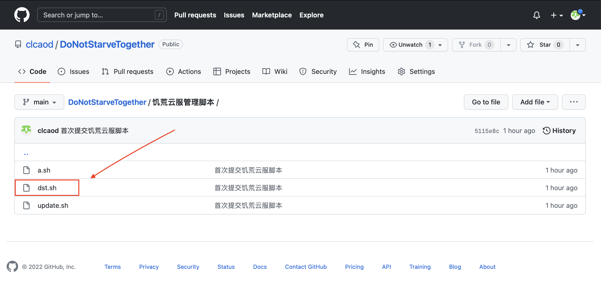
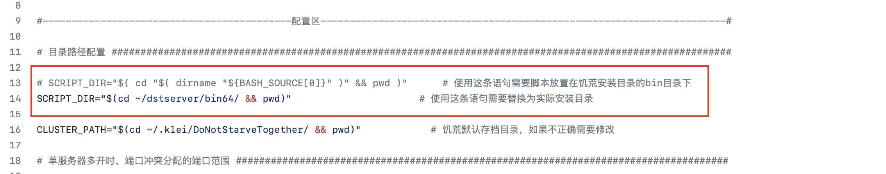
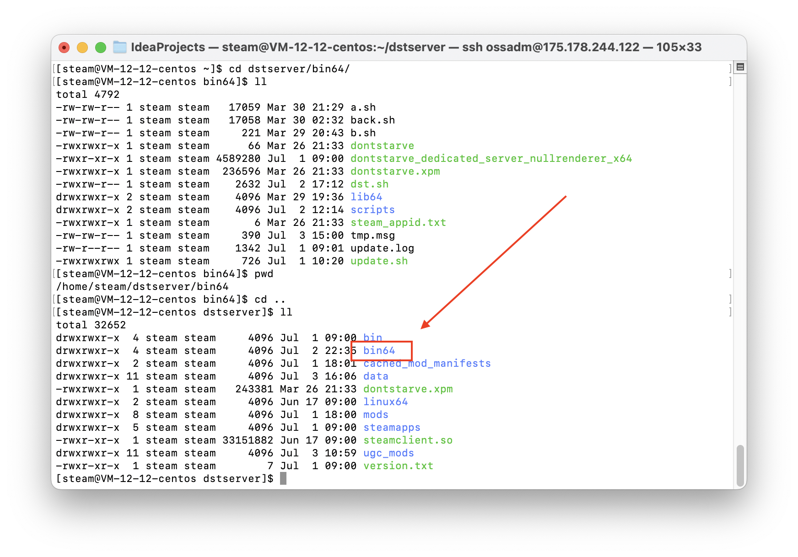
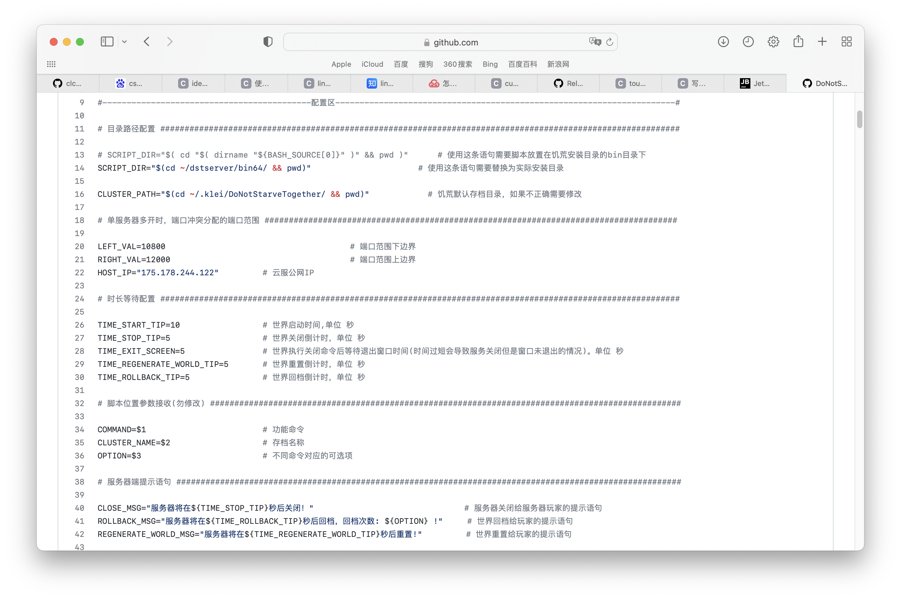
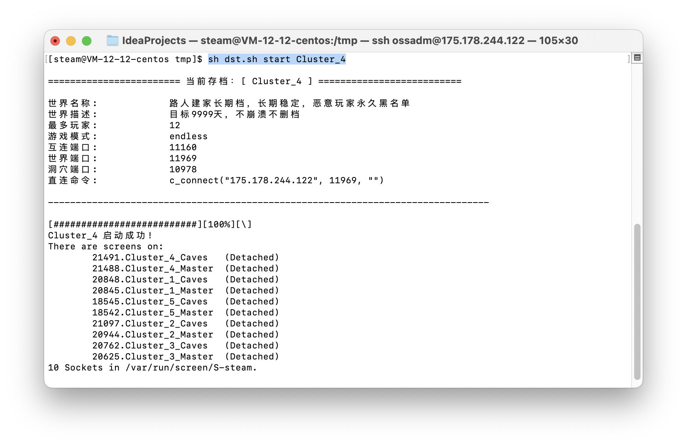
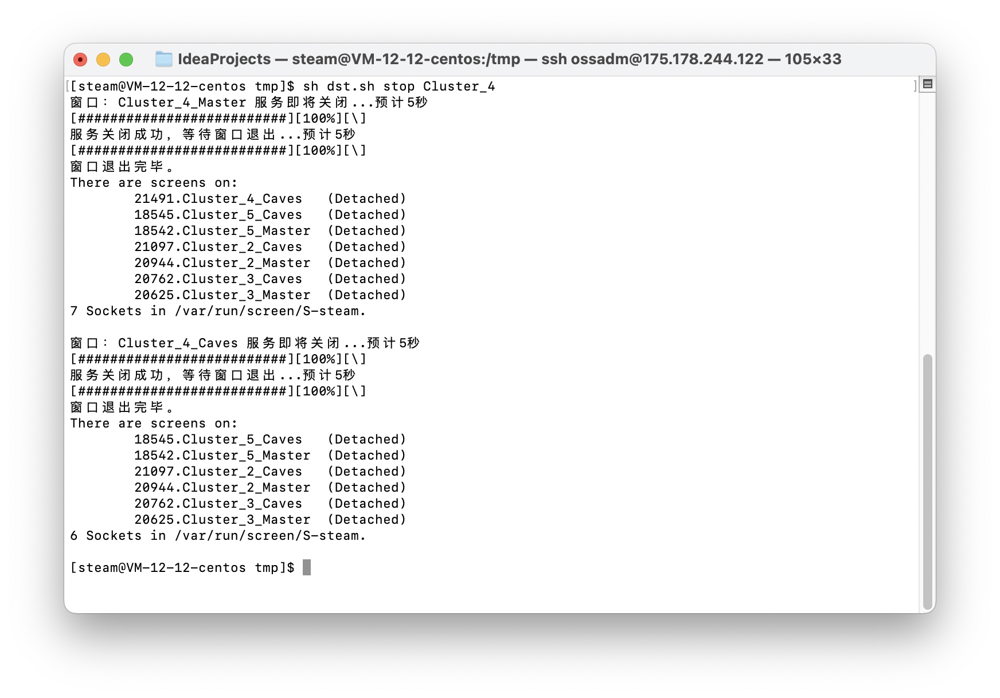
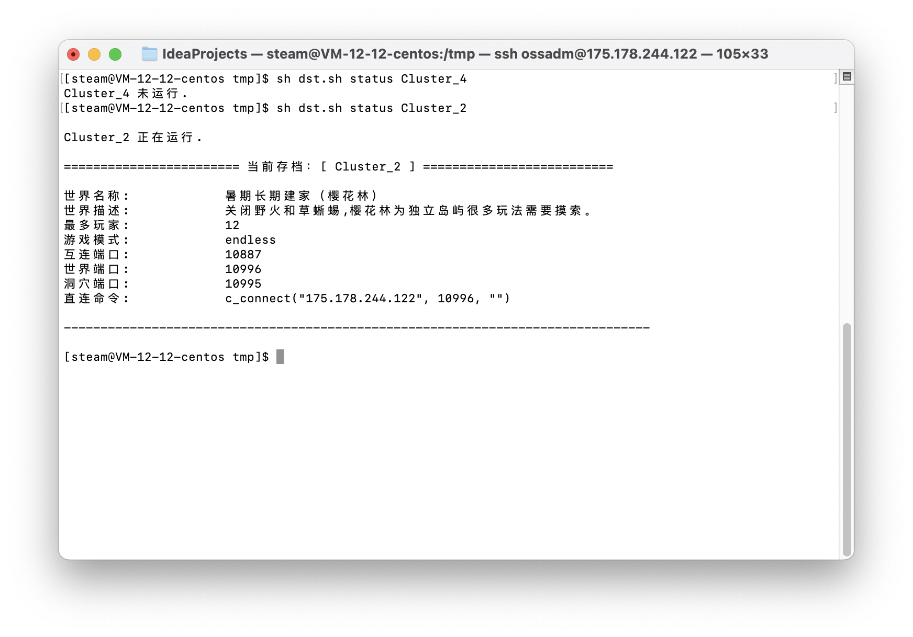
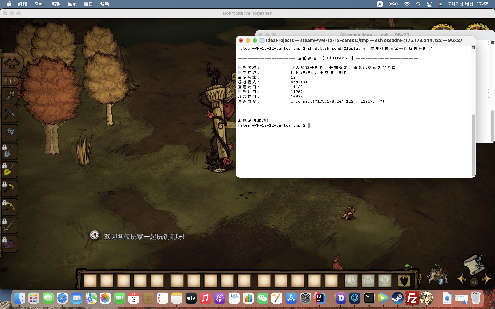
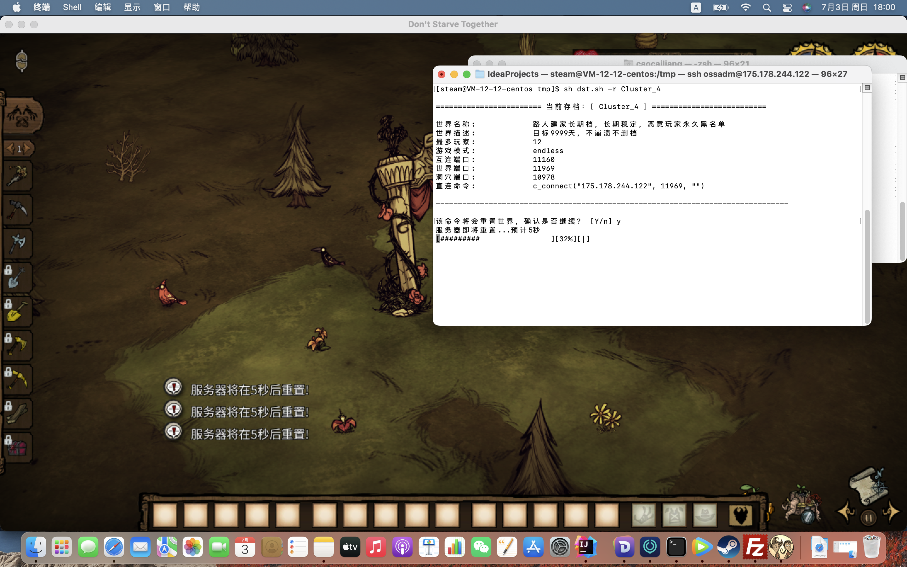
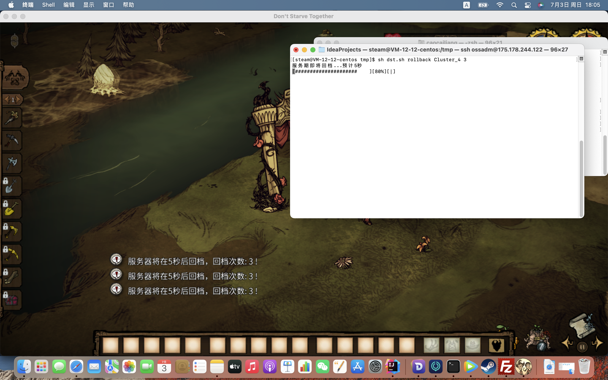

# DST
Don't Starve Together 饥荒联机版管理脚本

对云服存档开服的一些基本管理，旨在简化云服管理操作，降低管理成本。


## 一、功能
当前支持功能项：

- 启动世界
- 停止世界
- 重启世界
- 查询状态
- 发送通知
- 重置世界
- 世界回档
- 自动更新
- 封禁玩家
- 游戏内自查

---
## 二、快速开始
### 下载脚本


[点击下载](https://codeload.github.com/clcaod/DoNotStarveTogether/zip/refs/tags/dst)

GitHub链接：https://github.com/clcaod/DoNotStarveTogether.git

### 上传文件到服务器
可以通过<kbd>FileZilla</kbd><kbd>WinSCP</kbd>等FTP文件传输工具上传至 /tmp 目录

#### 1. 修改文件属组权限
文件需要和饥荒文件同属于一个用户。

比如我都是用steam用户则：
```shell
sudo chown steam:steam /tmp/dst.sh
```

#### 2. 配置文件所在目录
文件存放位置支持两种方式



推荐使用第一种方式（默认不需要修改脚本），只需要脚本放在指定目录下。

启用64位则放bin64目录下

启用32位则放bin目录下


#### 3. 脚本支持一些自定义的配置信息
- 自定义时长
- 自定义提示语句
- 自定义端口范围



---

### 脚本说明
语法格式
```shell
bash dst.sh <command> <cluster_name> <option>
```
输入参数<kbd> -h </kbd> 或者 <kbd> -help </kbd> 查看完整的命令语法

```shell
[steam@VM-12-12-centos tmp]$ sh dst.sh
Usage: 
  bash dst.sh <command> <cluster_name> <option>

  尝试 'bash dst.sh <start|stop|restart|status|send|-r|rollback|-h|--help> <cluster_name> [option]'
  尝试 'bash dst.sh -h 或者 bash dst.sh --help 查看更多信息
```

#### 启动世界
```shell
# 用法：
bash dst.sh start <cluster_name> [Master|Caves]

# 举例
# 该命令将启动存档 Cluster_1
bash dst.sh start Cluster_1 

# 支持仅启动世界或者洞穴，需添加参数指定
# 如指定仅世界：
bash dst.sh start Cluster_1 Master
```

回显效果


#### 停止世界
```shell
# 用法：
bash dst.sh stop <cluster_name> [Master|Caves]

# 举例
# 该命令将关闭存档 Cluster_1
bash dst.sh stop Cluster_1 

# 支持仅关闭世界或者洞穴，需添加参数指定
# 如指定仅世界：
bash dst.sh stop Cluster_1 Master
```
回显效果



#### 重启世界
```shell
# 用法
bash dst.sh restart <cluster_name> 

# 举例
# 该命令将重启存档 Cluster_1
bash dst.sh restart Cluster_1 

# 说明：重启为关闭后再启动
```

#### 查询状态
```shell
# 用法
bash dst.sh status <cluster_name> 

# 举例
# 该命令将查询存档 Cluster_1 的运行状态
bash dst.sh status Cluster_1
```
回显效果



#### 发送通知
```shell
# 用法
bash dst.sh send <cluster_name> [message]

# 举例
# 该命令将给存档 Cluster_1 发送消息 '欢迎各位玩家一起玩饥荒呀!'
bash dst.sh send Cluster_1 '欢迎各位玩家一起玩饥荒呀!'
```
回显效果



#### 重置世界
```shell
# 用法
bash dst.sh -r <cluster_name>

# 举例
# 重置命令需要二次确认
# 该命令将重置存档 Cluster_1 
bash dst.sh -r Cluster_1 
```
回显效果



#### 回档
```shell
# 用法
bash dst.sh rollback <cluster_name> [option]

# 举例
# 回档不指定次数默认 1 次
# 指定回档次数需要添加参数 
bash dst.sh rollback Cluster_1    # 默认回档 1 次
bash dst.sh rollback Cluster_1 3  # 指定回档 3 次
```
回显效果




